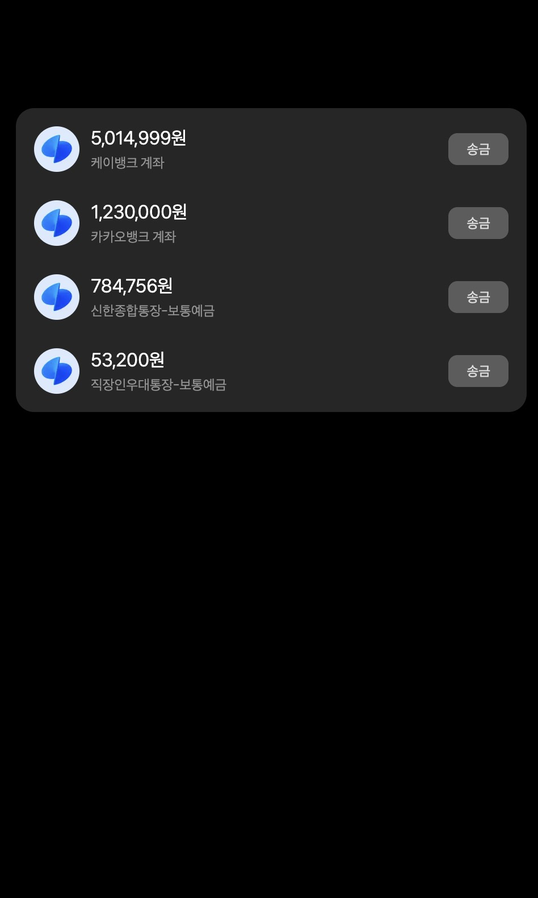
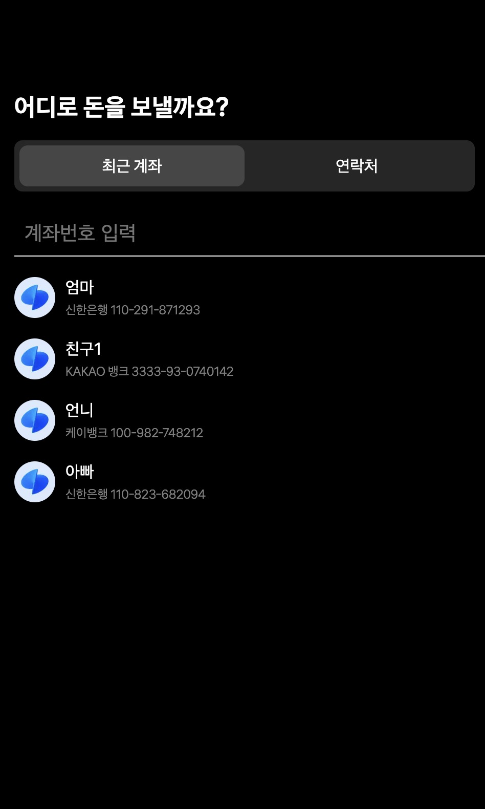
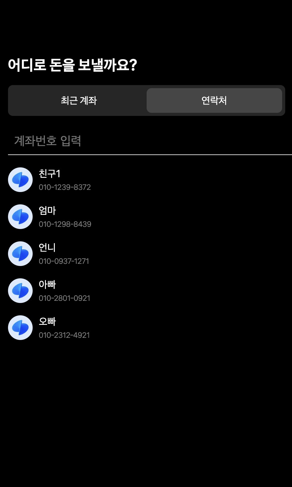
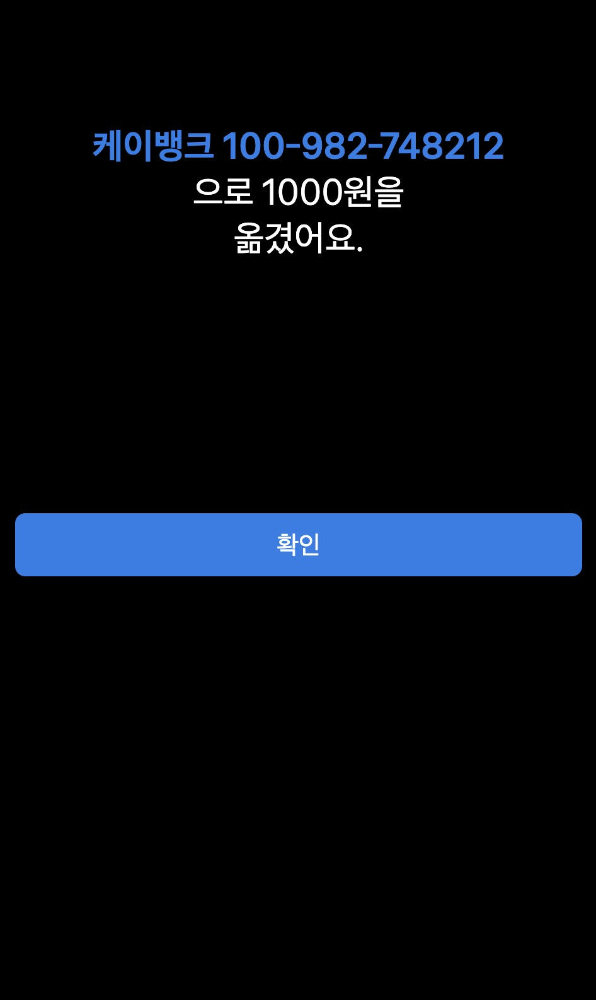

# 🚀 토스 송금하기 미니 프로젝트

## 📌 프로젝트 설명
이 프로젝트는 Next.js로 구성되어 있으며, 사용자는 송금할 사람(수신자)과 금액을 입력하고 송금 요청을 할 수 있습니다. 송금 요청은 실제 API와 연결되어 실제 송금 처리가 이루어집니다. 이 과정에서 zustand를 사용하여 애플리케이션의 상태를 관리하고, axios를 통해 API와 통신합니다.

## 🛠️ 기술스택
- Frontend: nextjs14
- 상태관리: zustand, tastack-query
- 스타일링: module.css

## 🎯 기능
- 송금정보: 사용자는 송금할 사람(수신자)과 송금액을 입력합니다. 송금하는 사람과 수신자의 정보는 해당 API 요청을 통해 처리되며, 사용자 입력을 실시간으로 반영합니다.
- 송금액 입력 및 포맷팅: 금액은 100,000와 같은 형식으로 입력되며, 이 값은 서버로 전송될 때는 100000과 같은 숫자만 포함됩니다. 금액 입력 필드는 천 단위 구분 기호를 자동으로 처리해 사용자 경험을 개선합니다.
- API 통신: Axios를 통해 송금 정보를 POST 방식으로 API에 전송하여 실제 송금 처리가 이루어집니다. 이 과정에서 금액, 송금자, 수신자 정보가 포함됩니다.
- 상태 관리: Zustand를 사용해 송금 요청 중의 상태를 관리합니다. 예를 들어, 송금 진행 상태, 오류 처리 등을 애플리케이션 전역에서 쉽게 관리할 수 있습니다.

## 📂 프로젝트 구조
├── public/             # 정적 파일 (이미지, 폰트 등)  
├── src/                # 소스 코드  
│   ├── api/            # API 요청 관련 파일 (Axios 설정, API 함수 등)  
│   ├── app/            # 페이지 및 라우팅 설정 (Next.js 페이지)  
│   ├── assets/         # 이미지, 폰트, 아이콘 등의 정적 자산  
│   ├── components/     # 재사용 가능한 UI 컴포넌트  
│   ├── store/          # Zustand 상태 관리 파일  
│   ├── utils/          # 유틸리티 함수들 (날짜 처리, 포맷팅 등)  
├── .env                # 환경 변수 설정 (API 키 등)

## 🖥️ 구현화면

  
  
  
  
  

## 🎯 개선사항
- 서버응답처리 (로딩바)
- 성능개선
- UX개선 (천단위 구분기호등)
